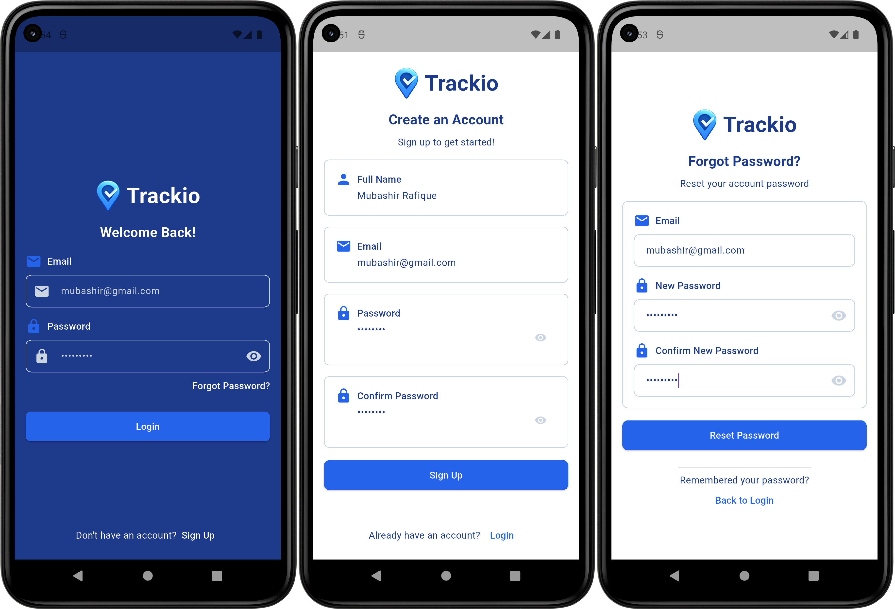
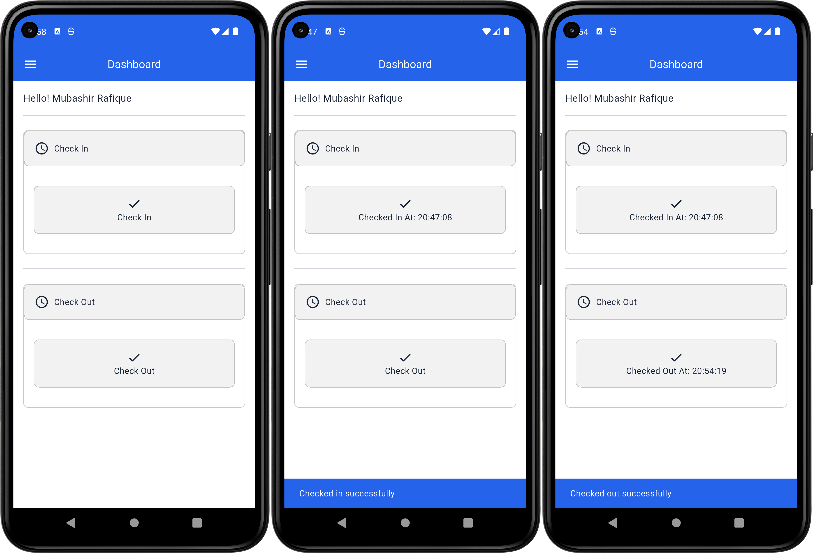
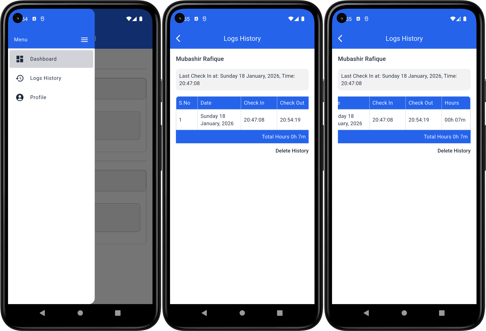
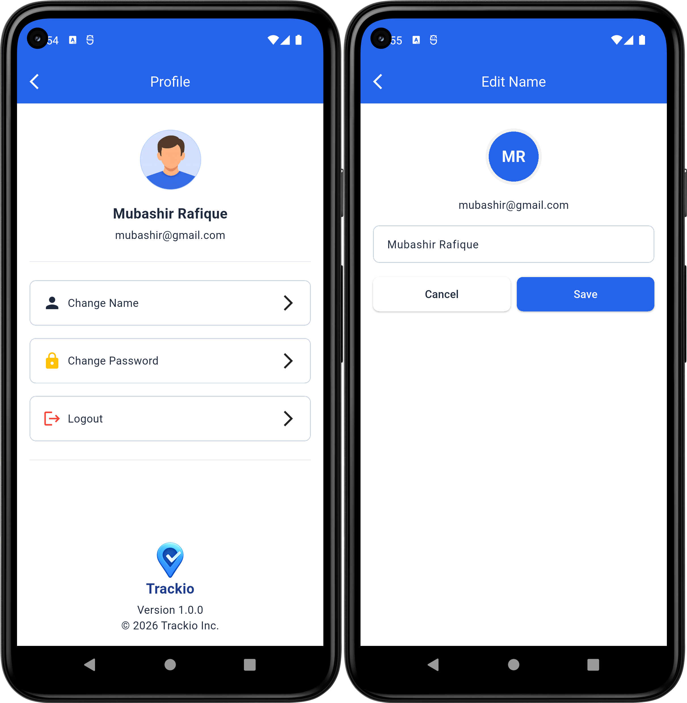

# Trackio

I built Trackio to help myself and others keep track of daily work and attendance in a simple and organized way. In this app, I implemented a check-in/check-out system to record work hours accurately, and I added a daily logs history so you can see all your past activities.
I focused on making it easy to use with a clean interface, and I handled all the data storage locally so all your work logs stay safe and accessible offline.

## Content

- [Features](#features)
- [Technology Stack](#technology-stack)
- [Tools & Libraries](#tools--libraries)
- [What I Learned](#what-i-learned)
- [Project Structure](#project-structure)
- [Prerequisites](#prerequisites)
- [Installation / Setup](#installation--setup)

## Features

### Authentication Screens

This app includes local authentication with login, sign-up, and forgot password screens. Users can create an account using their full name, email, and password with proper input validation. Login is handled by verifying credentials against locally stored data, and session state is saved using shared preferences.

The forgot password feature allows users to reset their password by providing their email and setting a new password. All authentication data is stored locally, allowing the app to work fully offline.



### Dashboard

The dashboard allows users to check in and check out to record daily work hours. It displays the user’s name and provides a simple interface to track attendance. Check-in and check-out times are captured using the current system time and formatted for display.

The app calculates total working hours based on check-in and check-out duration and stores each entry as a daily log in the local database. The last check-in state is preserved using shared preferences to prevent duplicate actions and ensure continuity across app sessions.



### Appbar & Logs History 

A reusable custom app bar is used to keep the layout consistent across screens. The logs history screen shows all recorded check-in and check-out entries in a table format, including date, time, and total hours worked.

Entries are fetched from the local database for the logged-in user. The screen also calculates total accumulated work hours and provides an option to delete the complete history.



### Profile & Edit Name

The profile screen displays basic user information such as full name and email, retrieved from local storage. It provides quick access to account-related actions including changing the name, updating the password, and logging out.

Users can edit their name through a dedicated screen where the updated value is saved in the local database and reflected across the app. Session state is managed locally, ensuring proper logout behavior and secure navigation between authentication and main screens. App details like version and copyright information are also shown at the bottom of the profile screen.



## Technology Stack

- Flutter (Dart)
- Material UI
- Local Database (sqflite)
- SharedPreferences
- Custom SharedPrefsService
- Android (primary target)

## Tools & Libraries

- Android Studio & Vs Code 
- Flutter SDK
- SnackBar Service
- Navigation (named routes)
- Custom Widgets (Appbar, AppText, AppContainer etc.)

## Project Structure

```text
trackio/
├─ .dart_tool/
├─ .idea/
├─ android/
├─ ios/
├─ assets/
│ └─ images/
│ ├─ app_icon.png
│ ├─ icon.png
│ ├─ logo.png
│ └─ profile_image.png
├─ screenshots/
├─ build/
├─ lib/
│ ├─ core/
│ │ ├─ constants/ (app_colors.dart, app_strings.dart)
│ │ ├─ data/
│ │ │ ├─ database/
│ │ │ │ ├─ Dao/
│ │ │ │ │ ├─ logs/ (logs_dao.dart)
│ │ │ │ │ └─ user/ (user_dao.dart)
│ │ │ │ ├─ constants/ (logs.dart)
│ │ │ │ ├─ helper/ (database_helper.dart)
│ │ │ │ └─ model/
│ │ │ │ ├─ logs/ (logs_table.dart)
│ │ │ │ └─ user/ (user_table.dart)
│ │ │ ├─ service/ (snack_bar_service.dart)
│ │ │ └─ shared_preference/service/ (shared_prefs_service.dart)
│ ├─ routes/ (route_names.dart, app_routes.dart)
│ ├─ ui/
│ │ ├─ screens/
│ │ │ ├─ auth/ (login, sign_up, forgot_password)
│ │ │ ├─ dashboard/ (dashboard_screen.dart)
│ │ │ ├─ edit_name/ (edit_name_screen.dart)
│ │ │ ├─ logs/ (logs_history_screen.dart)
│ │ │ ├─ profile/ (profile_screen.dart, model/items.dart)
│ │ │ └─ splash/ (splash_screen.dart)
│ │ └─ widgets/ (app_bar.dart, app_container.dart, app_drawer.dart, app_text.dart, app_text_button.dart, app_text_field.dart, app_elevated_button.dart, loading_indicator.dart)
│ └─ main.dart
├─ test/
├─ .flutter-plugins-dependencies
├─ .gitignore
├─ .metadata
├─ analysis_options.yaml
├─ devtools_options.yaml
├─ pubspec.lock
├─ pubspec.yaml
├─ README.md
└─ trackio.iml
```

## What I Learned

- Flutter Development
- Dart Programming
- State Management with Stateful Widgets
- Local Database Integration (SQLite with DAO)
- Shared Preferences & Session Handling
- Authentication Flow (Login, Logout, Password Reset)
- Navigation with Named Routes
- Custom Reusable Widgets
- Profile & Form Handling
- SnackBar & User Feedback
- UI/UX Design & Layout

## Prerequisites

Before running this app, make sure you have the following installed:

- Flutter SDK
- Dart SDK
- Android Studio or VS Code with Flutter & Dart plugins
- Xcode (if running on iOS)
- A connected device or emulator (Android or iOS)
- Git (for cloning the repository)

## Installation / Setup

1. **Clone the repository**
    ```bash
    git clone https://github.com/MubashirWork/Trackio-App.git
    ```

2. **Open the project folder**
    ```bash
    cd trackio
    ```

3. **Install flutter dependencies**
    ```bash
    flutter pub get
    ```

4. **Connect a device or start an emulator**
    - For Android: use an Android device or emulator
    - For iOS: use an iPhone device or simulator

5. **Run the app**
    ```bash
    flutter run
    ```